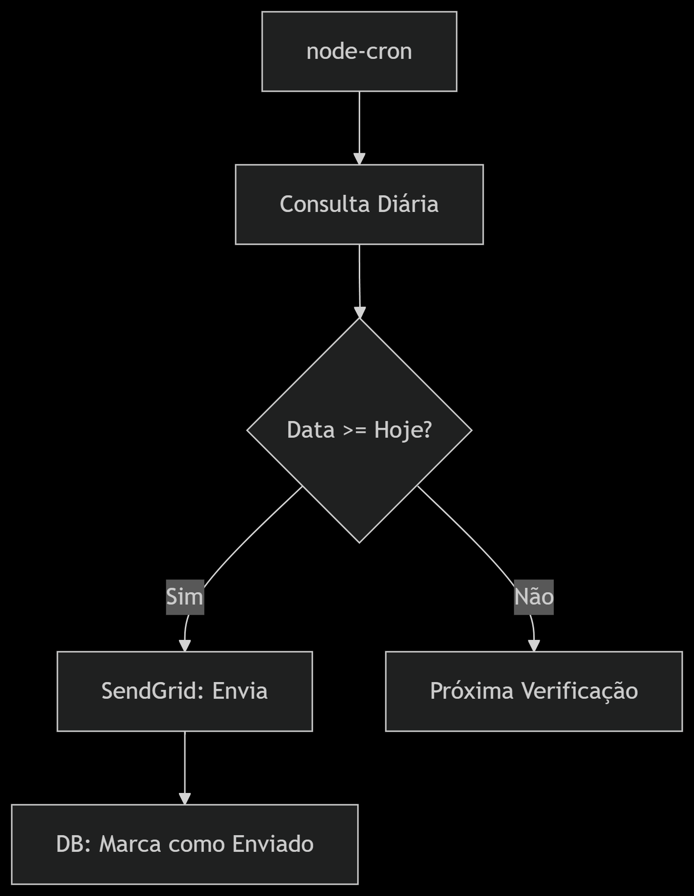
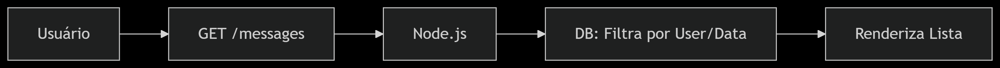
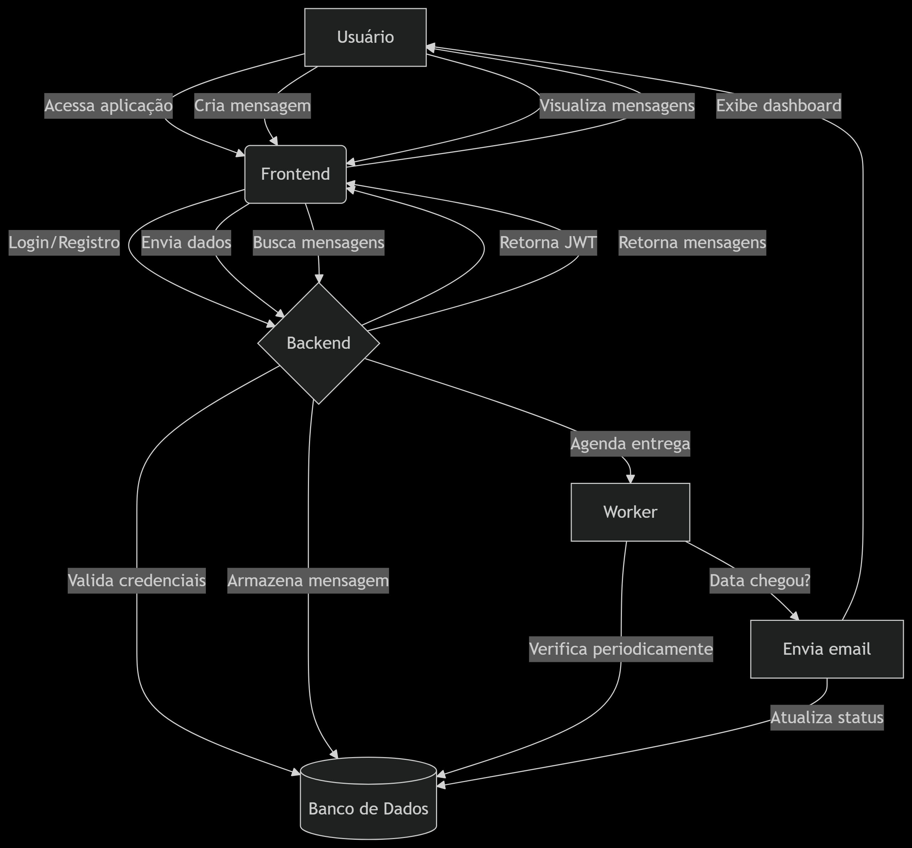

# Cápsula do Tempo

**Cápsula do Tempo** é uma aplicação web composta por um backend (API RESTful) e um frontend moderno. O sistema permite que usuários escrevam mensagens para si mesmos no futuro, agendando o envio por e-mail na data e hora desejadas.

---

## Objetivo

Proporcionar uma experiência única de reflexão, permitindo que qualquer pessoa registre pensamentos, desejos ou conselhos para o próprio futuro e receba essas mensagens automaticamente por e-mail no momento agendado.

---

## Arquitetura do Projeto

- **backend:** API RESTful desenvolvida em Node.js/Express, responsável por autenticação, persistência de dados, agendamento e envio de mensagens por e-mail.
- **frontend:** Aplicação React moderna, que consome a API para autenticação, agendamento e gerenciamento das mensagens do usuário.

---

## Funcionalidades Principais

### Backend (API RESTful)
- **Autenticação JWT:** Registro e login de usuários, com proteção de rotas.
- **CRUD de Mensagens:** Endpoints para criar, listar, editar e excluir mensagens agendadas.
- **Envio Automático de E-mails:** Job que verifica mensagens agendadas e envia por e-mail usando SendGrid.
- **Persistência com Supabase:** Armazenamento seguro de usuários e mensagens.

### Frontend
- **Cadastro e Login:** Interface amigável para registro e autenticação.
- **Dashboard:** Visualização de mensagens agendadas e já enviadas.
- **Agendamento de Mensagens:** Formulário para escrever e agendar mensagens para o futuro.
- **Edição e Exclusão:** Gerenciamento completo das mensagens antes do envio.
- **Logout:** Encerramento seguro da sessão.

---

## Tecnologias Utilizadas

- **Frontend:** React, TypeScript, Vite, React Router
- **Backend:** Node.js, Express, Supabase, SendGrid, JWT, Bcrypt
- **Outros:** Docker (opcional para deploy), dotenv para variáveis de ambiente

---

## Fluxo de Funcionamento

1. O usuário se cadastra e faz login pelo frontend.
2. No dashboard, pode agendar mensagens para o futuro, informando o texto e a data/hora de entrega.
3. As mensagens ficam salvas no banco de dados (Supabase) e podem ser editadas ou excluídas até o momento do envio.
4. Um processo no backend verifica periodicamente as mensagens agendadas e, quando chega o momento, envia o conteúdo por e-mail ao usuário.
5. O usuário recebe a mensagem na caixa de entrada, vinda do seu "eu do passado".

---

## Instalação e Execução

### Pré-requisitos
- Node.js (v18+ recomendado)
- Conta no [Supabase](https://supabase.com/) e [SendGrid](https://sendgrid.com/)
- Yarn ou npm

### Variáveis de Ambiente

Crie um arquivo `.env` em ambos os diretórios (`backend/` e `frontend/`) com as seguintes variáveis:

#### backend (`backend/.env`):
```env
SUPABASE_URL=...
SUPABASE_KEY=...
SENDGRID_API_KEY=...
SENDGRID_FROM_EMAIL=...
SECRET_KEY=...
PORT=5000
```

#### frontend (`frontend/.env`):
```env
VITE_SUPABASE_URL=...
VITE_SUPABASE_KEY=...
```

### Rodando o backend
```bash
cd backend
npm install
npm run dev
```
O backend (API) estará disponível em `http://localhost:5000`.

### Rodando o frontend
```bash
cd frontend
npm install
npm run dev
```
O frontend estará disponível em `http://localhost:5173`.

---

## Testes e Logs no Backend

O backend utiliza logs detalhados via `console.log` e `console.error` para monitoramento e depuração de todas as operações importantes, incluindo autenticação, manipulação de mensagens, execução de jobs e integração com o Supabase e SendGrid.

### Exemplos de Logs
- Início e resultado de jobs automáticos:
  - `=== JOB: INICIANDO PROCESSAMENTO ===`
  - `Encontradas X mensagens para processar`
  - `Processando mensagem <id> para usuário <user_id>`
  - `E-mail enviado, marcando como enviada...`
- Operações de CRUD:
  - `=== BACKEND: CRIANDO MENSAGEM ===`
  - `Mensagem salva com sucesso!`
  - `=== DELETE /messages/:id ===`
  - `Mensagem deletada com sucesso!`
- Autenticação:
  - `Usuário encontrado: { id, email }`
  - `Token gerado com userId: <id>`
- Erros:
  - `Erro ao buscar mensagens agendadas: <mensagem>`
  - `Erro ao enviar mensagem agendada: <mensagem>`

Esses logs aparecem no terminal onde o backend está rodando e são essenciais para identificar problemas em ambientes de desenvolvimento e produção.

### Testando o backend
- Utilize ferramentas como **Postman** ou **Insomnia** para testar os endpoints da API (`/auth/register`, `/auth/login`, `/messages`, etc.).
- Para testar o envio de e-mails, utilize a rota `/test-email` (POST) enviando `{ to, subject, text }` no corpo da requisição.
- O job de envio automático de mensagens pode ser acompanhado pelos logs no terminal. Ele é executado a cada minuto e também imediatamente ao iniciar o backend.

---

## Estrutura do Projeto

```text
capsula-tempo/
  backend/
    src/
      routes/
      services/
      lib/
    app.js
    package.json
  frontend/
    src/
      components/
      pages/
      services/
      hooks/
      lib/
    package.json
```

---

## Fluxogramas do Sistema

### 1. Fluxo de Autenticação/Login


### 2. Fluxo de Criação de Mensagem


### 3. Fluxo do Job de Envio Automático


### 4. Fluxo de Listagem de Mensagens


### 5. Fluxo Geral do Sistema


---

## Observações
- O backend é uma **API RESTful** e pode ser acessado por outros clientes além do frontend fornecido.
- O frontend foi desenvolvido para fazer requisições exclusivamente para essa API, mas pode ser adaptado para outros backends compatíveis.

---

## Contribuição
Contribuições são bem-vindas! Sinta-se à vontade para abrir issues ou pull requests.

## Licença
Este projeto está sob a licença MIT. 

## Deploy e Produção

### Pré-requisitos para Produção
- Conta no [Supabase](https://supabase.com/) configurada
- Conta no [SendGrid](https://sendgrid.com/) configurada
- Conta no [Vercel](https://vercel.com/) (gratuita)
- Conta no [Render](https://render.com/) (gratuita)

### Deploy Automático (Recomendado)

#### 1. Deploy do Backend no Render

1. **Acesse [Render](https://render.com/)**
2. **Conecte seu GitHub** e selecione o repositório
3. **Configure o serviço:**
   - **Type:** Web Service
   - **Environment:** Node
   - **Build Command:** `npm install`
   - **Start Command:** `npm start`
   - **Root Directory:** `backend` (ou use a branch `backend-deploy`)
4. **Configure as variáveis de ambiente:**
```env
NODE_ENV=production
PORT=10000
SUPABASE_URL=your_supabase_url
SUPABASE_KEY=your_supabase_service_role_key
SENDGRID_API_KEY=your_sendgrid_api_key
SENDGRID_FROM_EMAIL=noreply@yourdomain.com
SECRET_KEY=your_jwt_secret_key
FRONTEND_URL=https://your-frontend-url.vercel.app
```

#### 2. Deploy do Frontend no Vercel

1. **Acesse [Vercel](https://vercel.com/)**
2. **Conecte seu GitHub** e selecione o repositório
3. **Configure o projeto:**
   - **Framework Preset:** Vite
   - **Root Directory:** `frontend`
   - **Build Command:** `npm run build`
   - **Output Directory:** `dist`
4. **Configure as variáveis de ambiente:**
```env
VITE_API_URL=https://your-backend-url.onrender.com
VITE_SUPABASE_URL=your_supabase_url
VITE_SUPABASE_KEY=your_supabase_anon_key
```

### Deploy Manual

#### Backend
```bash
cd backend
npm install --production
npm start
```

#### Frontend
```bash
cd frontend
npm install
npm run build
# Sirva os arquivos da pasta dist/
```

### Configurações de Segurança

- Use HTTPS em produção (automático no Vercel/Render)
- Configure CORS adequadamente
- Use variáveis de ambiente para secrets
- Configure rate limiting
- Implemente logs de auditoria

--- 

